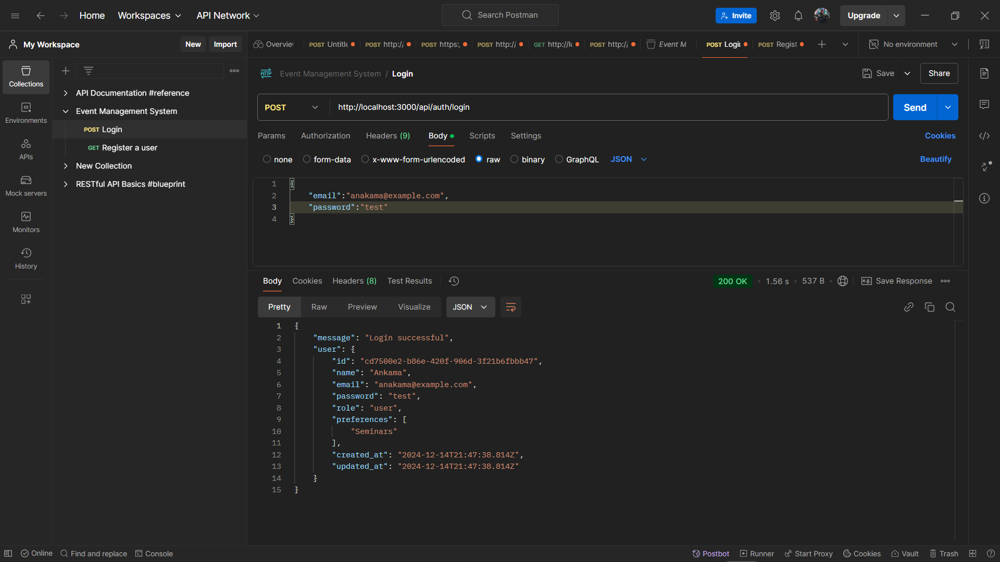
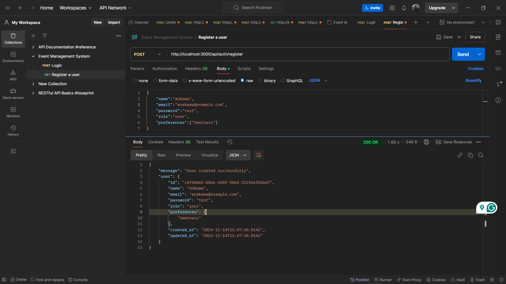
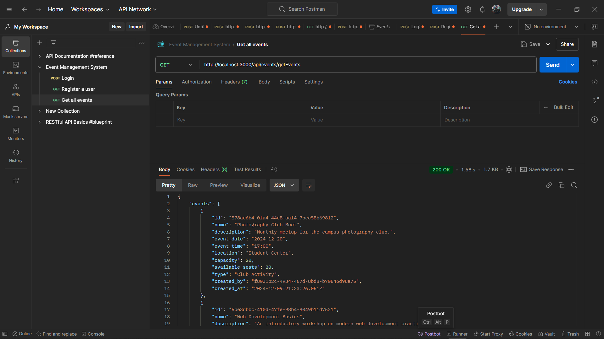

# Campus Event Management System - Backend

This is the backend service for the Campus Event Management System. It provides RESTful API endpoints for managing events, user authentication, and more.

## 🛠 Tech Stack

### Backend
- **Node.js** with **Express**: For building the server and handling HTTP requests.
- **PostgreSQL**: As the database for storing user and event data.
- **bcryptjs**: For hashing passwords securely.
- **CORS**: To enable cross-origin resource sharing.

## 📦 Installation

### Prerequisites
- **Node.js** (v14 or higher)
- **PostgreSQL** database
- **npm** or **yarn** package manager

### Setup Instructions

1. **Clone the repository**:
   ```bash
   git clone https://github.com/yourusername/eventix-backend.git
   ```

2. **Navigate to the backend directory**:
   ```bash
   cd eventix-backend
   ```

3. **Install dependencies**:
   ```bash
   npm install
   ```

4. **Set up the database**:
   - Ensure PostgreSQL is running.
   - Create a database named `event_management_site`.
   - Update the connection string in `config/db.js` with your database credentials.

5. **Run the development server**:
   ```bash
   npm start
   ```

## 🗄️ Database Schema

### Users Table
- `id` (Primary Key)
- `name`
- `email`
- `password` (hashed)
- `role` (admin/user)
- `preferences` (array)

### Events Table
- `id` (Primary Key)
- `name`
- `description`
- `location`
- `event_date`
- `event_time`
- `type`
- `capacity`
- `available_seats`
- `created_by`


## 🔐 API Endpoints

### Authentication
- **POST** `/api/auth/login` - User login
- **POST** `/api/auth/register` - User registration

### Events
- **GET** `/api/events/getEvents` - Get all events
- **POST** `/api/events/createEvent` - Create new event


## 🛠 Screenshots

### Login Endpoint


### Signup Endpoint


### Event Creation


### Get Events



## 👥 Contributing

1. Fork the repository
2. Create your feature branch (`git checkout -b feature/AmazingFeature`)
3. Commit your changes (`git commit -m 'Add some AmazingFeature'`)
4. Push to the branch (`git push origin feature/AmazingFeature`)
5. Open a Pull Request

## 🙏 Acknowledgments

- Node.js and Express for the server framework
- PostgreSQL for the database
- bcryptjs for password hashing